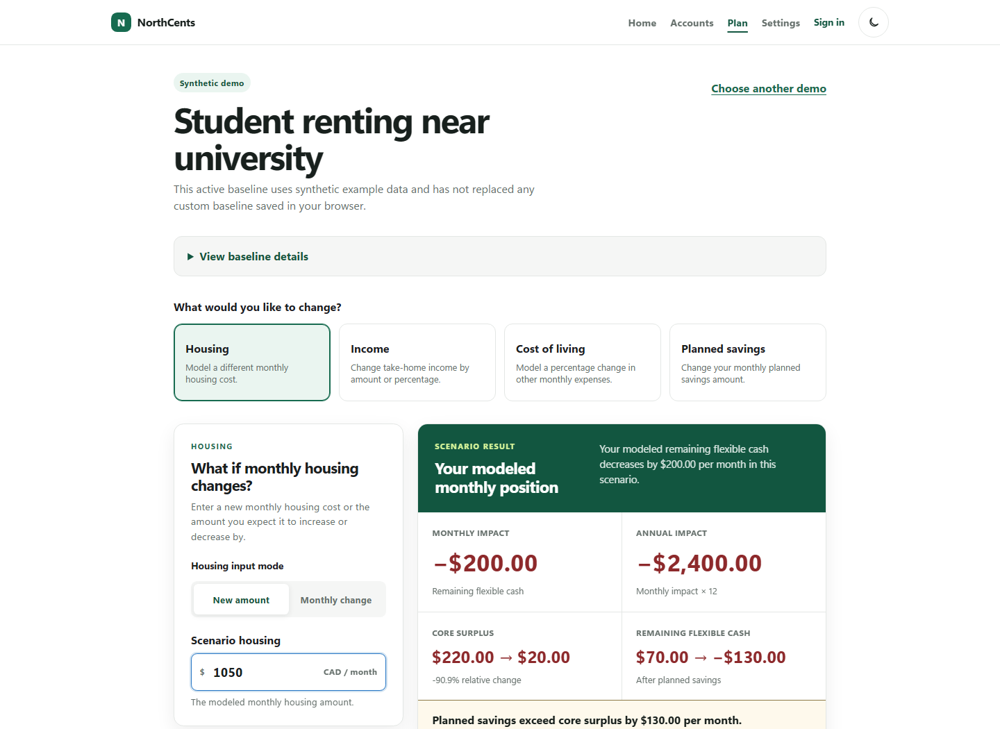
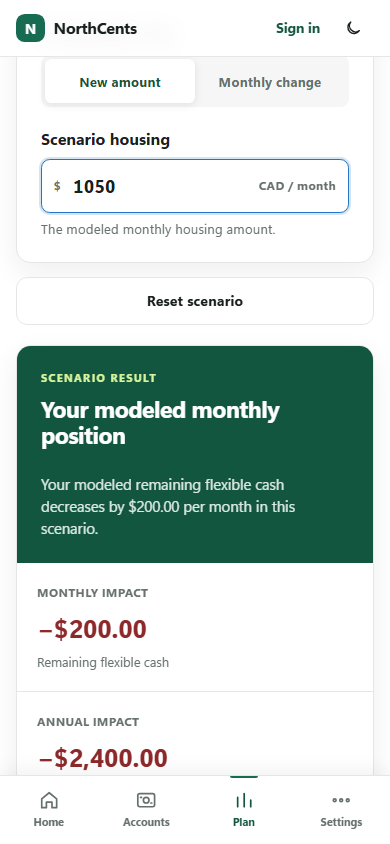

# NorthCents

**Your money, with direction.**

NorthCents is a privacy-first personal money app for tracking accounts,
planning monthly spending, and testing clear what-if scenarios. It uses exact
integer-cent calculations and keeps local data in the browser unless the user
explicitly chooses cloud backup.

## Product preview



<p align="center">
  
</p>

## Highlights

- Manually track cash, bank, investment, crypto, and debt accounts.
- See derived spendable cash, assets, liabilities, and net worth.
- Build a monthly plan for essentials, savings, goals, and flexible spending.
- Model housing, income, cost-of-living, and savings changes.
- Review transparent monthly and annual impacts without financial advice.
- Use synthetic demos without creating an account.
- Work locally by default, with optional Supabase authentication and backup.
- Navigate a responsive, keyboard-accessible interface on phone or desktop.

## Built with

Next.js, React, TypeScript, Supabase, IndexedDB, Zod, Vitest, React Testing
Library, Playwright, and axe-core.

## Run locally

```bash
npm ci
npm run dev
```

Open [http://localhost:3000](http://localhost:3000). The app works without
environment variables in local/demo mode. Optional cloud features are described
in [docs/supabase-setup.md](docs/supabase-setup.md).

## Verify

```bash
npm run check
npm run test:e2e
npm run test:a11y
```

## Privacy

NorthCents never asks for bank credentials and includes no bank connection,
analytics, advertising, or financial-data API. Local financial data stays in
the browser. Cloud transfer occurs only when a signed-in user explicitly saves
or restores a workspace.

## Documentation

- [Architecture](docs/architecture.md)
- [Implementation blueprint](docs/implementation-blueprint.md)
- [Deployment guide](docs/deployment.md)
- [Supabase setup](docs/supabase-setup.md)

NorthCents provides educational financial and economic analysis—not financial
advice.
